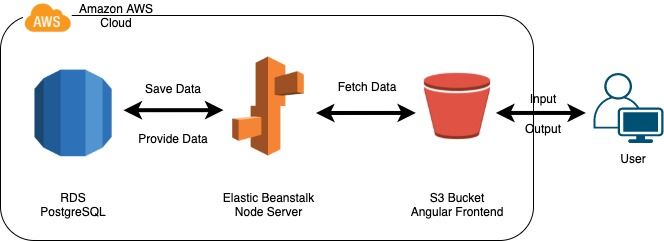
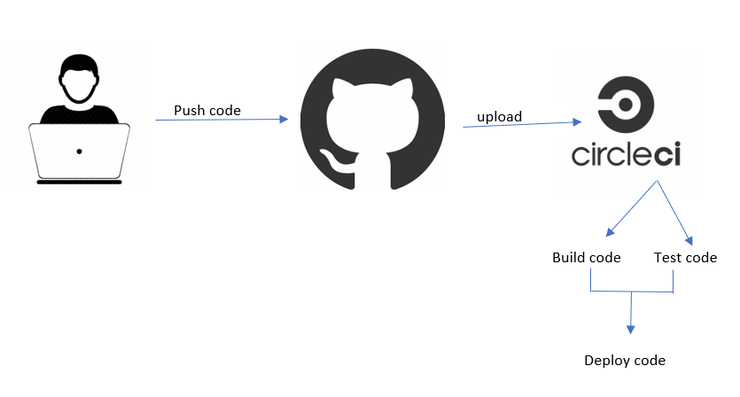

# Hosting a Full-Stack Application

## front-end link 
http://udagram-api-udacity.s3-website-us-east-1.amazonaws.com

## components of the application 
    - RDS database that stores info and data of the website
    - ElasticBeanstalk that runs the server side
    - S3 bucket that hosts the client side (hosting the static app, media, server)

## Architecture Design for the application

## pipeline process

## main dependancies 
    - aws cli
    - Node
    - npm
    - elasticbeanstalk cli
    - angular cli